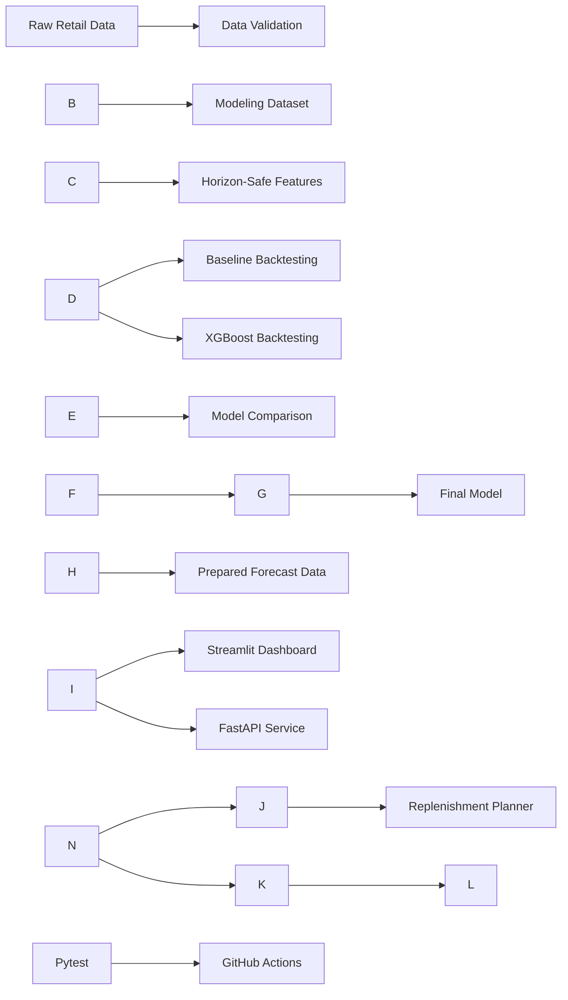

<div align="center">

# 🛍️ Retail Demand Forecasting

### Leakage-aware demand forecasting and replenishment decision support for multi-store retail planning

[!\[Live Dashboard](https://img.shields.io/badge/Live%20Dashboard-Open%20App-FF4B4B?style=for-the-badge&logo=streamlit&logoColor=white)](https://retail-demand-forecasting-momo.streamlit.app)
[!\[API Documentation](https://img.shields.io/badge/FastAPI-API%20Docs-009688?style=for-the-badge&logo=fastapi&logoColor=white)](https://retail-demand-forecasting-api-momo.onrender.com/docs)

[!\[Python](https://img.shields.io/badge/Python-3.11-3776AB?style=flat-square&logo=python&logoColor=white)](https://www.python.org/)
[!\[XGBoost](https://img.shields.io/badge/XGBoost-Forecasting-EB5B25?style=flat-square)](https://xgboost.readthedocs.io/)
[!\[Streamlit](https://img.shields.io/badge/Streamlit-Dashboard-FF4B4B?style=flat-square&logo=streamlit&logoColor=white)](https://streamlit.io/)
[!\[FastAPI](https://img.shields.io/badge/FastAPI-REST%20API-009688?style=flat-square&logo=fastapi&logoColor=white)](https://fastapi.tiangolo.com/)
[!\[Pytest](https://img.shields.io/badge/Pytest-Tested-0A9EDC?style=flat-square&logo=pytest&logoColor=white)](https://docs.pytest.org/)
[!\[Python Tests](https://github.com/momo840505/retail-demand-forecasting/actions/workflows/tests.yml/badge.svg)](https://github.com/momo840505/retail-demand-forecasting/actions/workflows/tests.yml)

</div>

\---

## 📌 Project Overview

Retail demand changes with seasonality, promotions, holidays, store characteristics, and customer behaviour. Poor demand planning can lead to stockouts, excess inventory, and inefficient replenishment decisions.

This project delivers an end-to-end retail forecasting and decision-support platform that:

* forecasts daily product-family demand for individual stores;
* evaluates models using chronological backtesting;
* prevents target leakage with horizon-safe feature engineering;
* compares XGBoost against transparent baseline methods;
* converts demand forecasts into replenishment recommendations;
* exposes results through an interactive Streamlit dashboard;
* provides forecast and replenishment endpoints through FastAPI;
* validates the codebase using pytest and GitHub Actions.

> \\\*\\\*Important:\\\*\\\* The deployed application is a historical portfolio demonstration. It displays prepared forecasts for 16 August 2017 to 31 August 2017 and is not connected to a live retailer inventory system.

\---

## 🚀 Live Applications

### Interactive Dashboard

Explore network demand, store-level forecasts, promotion activity, model performance, and inventory decisions.

👉 [Open the Streamlit Dashboard](https://retail-demand-forecasting-momo.streamlit.app)

### Forecasting API

Access model metadata, store references, product families, store-family forecasts, and replenishment recommendations.

👉 [Open the FastAPI Documentation](https://retail-demand-forecasting-api-momo.onrender.com/docs)

### API Health Check

👉 [Check API Status](https://retail-demand-forecasting-api-momo.onrender.com/health)

> The API is hosted on a free Render instance. The first request after inactivity may take longer while the service starts.

\---

## 🖼️ Dashboard Preview

### Network Pulse

The network view summarizes expected demand across all stores and product families.

!\[Network Pulse](docs/images/dashboard-network-pulse.png)

### Store Story

The store-level view shows historical demand and the next 16 days of expected sales for the selected store and product family.

!\[Store Story](docs/images/dashboard-store-story.png)

### Stock Decision

The replenishment workspace converts forecast demand and inventory assumptions into a practical ordering recommendation.

!\[Stock Decision](docs/images/dashboard-stock-decision.png)

\---

## ✨ Key Features

### 📈 Demand Forecasting

* 16-day daily demand forecasts
* store and product-family level predictions
* XGBoost regression with a log-transformed target
* calendar, promotion, holiday, oil-price, lag, and rolling features
* non-negative forecast outputs

### 🕒 Leakage-Aware Validation

* chronological train-validation splits
* four consecutive outer validation periods
* separate inner validation for model selection
* forecast-horizon-safe lag features
* shifted rolling statistics
* outer test periods isolated from tuning decisions

### 📦 Replenishment Decision Support

* current and inbound inventory inputs
* lead-time demand
* configurable review period
* safety-stock buffer
* reorder point and target inventory level
* case-pack rounding
* minimum order quantity
* stockout risk classification

### 🖥️ Interactive Dashboard

* network-wide demand overview
* store and product-family selection
* historical and future demand chart
* forecast-day slider
* promotion activity
* downloadable forecast data
* replenishment scenario planner
* model performance summary
* baseline comparison
* feature importance
* chronological fold results

### ⚡ REST API

* service health monitoring
* model information
* available stores
* available product families
* store-family forecasts
* replenishment recommendations
* Swagger and ReDoc documentation

### ✅ Engineering Quality

* reusable package under `src/`
* automated unit and integration tests
* GitHub Actions continuous integration
* deployment-ready forecast data
* Python 3.11 deployment configuration
* separate Streamlit and API deployments

\---

## 📊 Model Performance

The final model was evaluated using four chronological 16-day validation periods.

|Metric|Result|
|-|-:|
|Pooled WAPE|**12.78%**|
|Pooled RMSLE|**0.3877**|
|WAPE improvement over best baseline|**24.50%**|
|RMSLE improvement over best baseline|**22.56%**|
|Backtesting folds|**4**|
|Forecast horizon|**16 days**|
|Training history per fold|**730 days**|
|Inner validation window|**16 days**|

### Why Two Metrics?

**WAPE** measures total absolute forecast error relative to total demand and is useful for operational planning.

**RMSLE** evaluates proportional error after log transformation and reduces the influence of very large sales values.

\---

## 🧠 Forecasting Methodology

### 1\. Data Preparation

The modeling dataset combines historical sales, store numbers, product families, promotions, store metadata, holidays, events, oil-price history, and calendar variables.

### 2\. Horizon-Safe Feature Engineering

The forecast horizon is 16 days. Features therefore use only information available before the forecast period begins.

Examples include:

* `sales\\\_lag\\\_16`
* `sales\\\_lag\\\_21`
* `sales\\\_lag\\\_28`
* `sales\\\_lag\\\_35`
* `sales\\\_lag\\\_364`
* shifted rolling mean
* shifted rolling standard deviation
* historical oil-price features
* known calendar and promotion variables

Any lag shorter than the forecast horizon is rejected by the feature-engineering logic.

### 3\. Chronological Backtesting

The project uses:

* four consecutive outer validation periods;
* a 16-day forecast horizon;
* a 730-day rolling training window;
* a separate 16-day inner validation period;
* outer validation periods used only for final evaluation.

### 4\. Baseline Comparison

The XGBoost model is compared against:

* zero forecast;
* lag-16 forecast;
* lag-364 forecast;
* weekly seasonal naive forecast;
* shifted 28-day mean forecast.

### 5\. Final Forecast

After chronological evaluation, the final model produces a 16-day forecast for every store and product-family combination in the deployment dataset.

\---

## 🏗️ System Architecture



\---

## 📦 Replenishment Logic

The replenishment module is deterministic decision support rather than a learned inventory-optimization model.

```text
Inventory Position =
Current Inventory + Inbound Inventory
```

```text
Safety Stock =
Average Daily Forecast × Safety-Stock Days
```

```text
Reorder Point =
Lead-Time Demand + Safety Stock
```

```text
Target Inventory Level =
Protection-Period Demand + Safety Stock
```

```text
Raw Order Quantity =
Target Inventory Level − Inventory Position
```

The final suggested quantity also applies non-negative order constraints, minimum order quantity, case-pack rounding, and forecast coverage validation.

\---

## ⚡ API Endpoints

|Method|Endpoint|Description|
|-|-|-|
|GET|`/`|Return API service information|
|GET|`/health`|Verify API and forecast-data availability|
|GET|`/model-info`|Return model and validation information|
|GET|`/stores`|List available stores|
|GET|`/families`|List available product families|
|GET|`/forecasts`|Return a store-family forecast|
|POST|`/replenishment`|Calculate a replenishment recommendation|

### Forecast Request Example

```text
GET /forecasts?store\\\_nbr=1\\\&family=AUTOMOTIVE
```

### Replenishment Request Example

```json
{
  "store\\\_nbr": 1,
  "family": "AUTOMOTIVE",
  "current\\\_inventory": 20,
  "inbound\\\_inventory": 0,
  "lead\\\_time\\\_days": 3,
  "safety\\\_stock\\\_days": 2,
  "review\\\_period\\\_days": 7,
  "case\\\_pack\\\_size": 6,
  "minimum\\\_order\\\_quantity": 12
}
```

Interactive API documentation:

```text
https://retail-demand-forecasting-api-momo.onrender.com/docs
```

\---

## 🗂️ Project Structure

```text
retail-demand-forecasting/
│
├── .github/
│   └── workflows/
│       └── tests.yml
├── .streamlit/
│   └── config.toml
├── api/
│   ├── \\\_\\\_init\\\_\\\_.py
│   └── main.py
├── dashboard/
│   ├── app.py
│   ├── requirements.txt
│   └── data/
├── docs/
│   ├── images/
│   │   ├── dashboard-network-pulse.png
│   │   ├── dashboard-stock-decision.png
│   │   └── dashboard-store-story.png
│   ├── backtesting\\\_strategy.md
│   ├── data\\\_source.md
│   ├── feature\\\_availability.md
│   └── replenishment\\\_assumptions.md
├── scripts/
├── src/
│   └── retail\\\_forecasting/
├── tests/
├── .python-version
├── pyproject.toml
├── requirements.txt
├── requirements-dev.txt
└── README.md
```

\---

## 🛠️ Local Installation

### 1\. Clone the Repository

```bash
git clone https://github.com/momo840505/retail-demand-forecasting.git
cd retail-demand-forecasting
```

### 2\. Create a Virtual Environment

#### Windows PowerShell

```powershell
python -m venv .venv
.\\\\.venv\\\\Scripts\\\\Activate.ps1
```

#### macOS or Linux

```bash
python -m venv .venv
source .venv/bin/activate
```

### 3\. Install Dependencies

```bash
python -m pip install --upgrade pip
python -m pip install -r requirements-dev.txt
python -m pip install -e .
```

\---

## ▶️ Run the Dashboard

```bash
python -m streamlit run dashboard/app.py
```

Local URL:

```text
http://localhost:8501
```

\---

## ▶️ Run the API

```bash
python -m uvicorn api.main:app --reload
```

API documentation:

```text
http://127.0.0.1:8000/docs
```

Health check:

```text
http://127.0.0.1:8000/health
```

\---

## 🧪 Testing

Run the complete test suite:

```bash
python -m pytest -q
```

Run syntax validation:

```bash
python -m compileall -q api dashboard src
```

Verify the FastAPI application:

```bash
python -c "from api.main import app; print(app.title)"
```

GitHub Actions automatically runs the test workflow for pushes and pull requests targeting `main`.

\---

## 🔄 Rebuild the Forecasting Pipeline

```bash
python scripts/verify\\\_raw\\\_data.py
python scripts/profile\\\_data.py
python scripts/build\\\_modeling\\\_dataset.py
python scripts/run\\\_baseline\\\_backtest.py
python scripts/run\\\_xgboost\\\_backtest.py
python scripts/train\\\_final\\\_model.py
python scripts/prepare\\\_dashboard\\\_data.py
```

\---

## 📚 Data Source

This project uses data from the Kaggle competition:

[Corporación Favorita Grocery Sales Forecasting](https://www.kaggle.com/competitions/favorita-grocery-sales-forecasting)

The original competition files are not included in this repository.

\---

## ⚠️ Limitations

* The deployed dashboard displays a fixed historical forecast window.
* Final competition test labels are unavailable.
* Inventory levels and supplier lead times are not included in the original dataset.
* Holding cost and stockout cost are not included.
* Minimum order constraints are user-defined assumptions.
* Stockout risk bands are deterministic rather than calibrated probabilities.
* Replenishment recommendations are decision support only.
* The Render API may take longer to respond after inactivity on the free hosting plan.

\---

## 🔭 Future Improvements

* prediction intervals;
* probabilistic demand forecasting;
* calibrated stockout probabilities;
* supplier lead-time variability;
* warehouse and transport constraints;
* persistent inventory storage;
* scheduled retraining;
* model monitoring and data-drift detection;
* regional and product-hierarchy forecasting;
* individual forecast explainability;
* automated data ingestion.

\---

## 💼 Portfolio Highlights

This project demonstrates experience in:

* time-series forecasting;
* feature engineering;
* leakage prevention;
* chronological model validation;
* XGBoost modeling;
* retail and supply-chain analytics;
* inventory decision support;
* dashboard development;
* REST API development;
* automated testing;
* continuous integration;
* cloud deployment;
* responsive web design.

\---

<div align="center">

### Built with Python, XGBoost, Streamlit, FastAPI, Plotly, pytest, GitHub Actions, and Render

[Live Dashboard](https://retail-demand-forecasting-momo.streamlit.app) ·
[API Documentation](https://retail-demand-forecasting-api-momo.onrender.com/docs) ·
[GitHub Repository](https://github.com/momo840505/retail-demand-forecasting)

</div>


