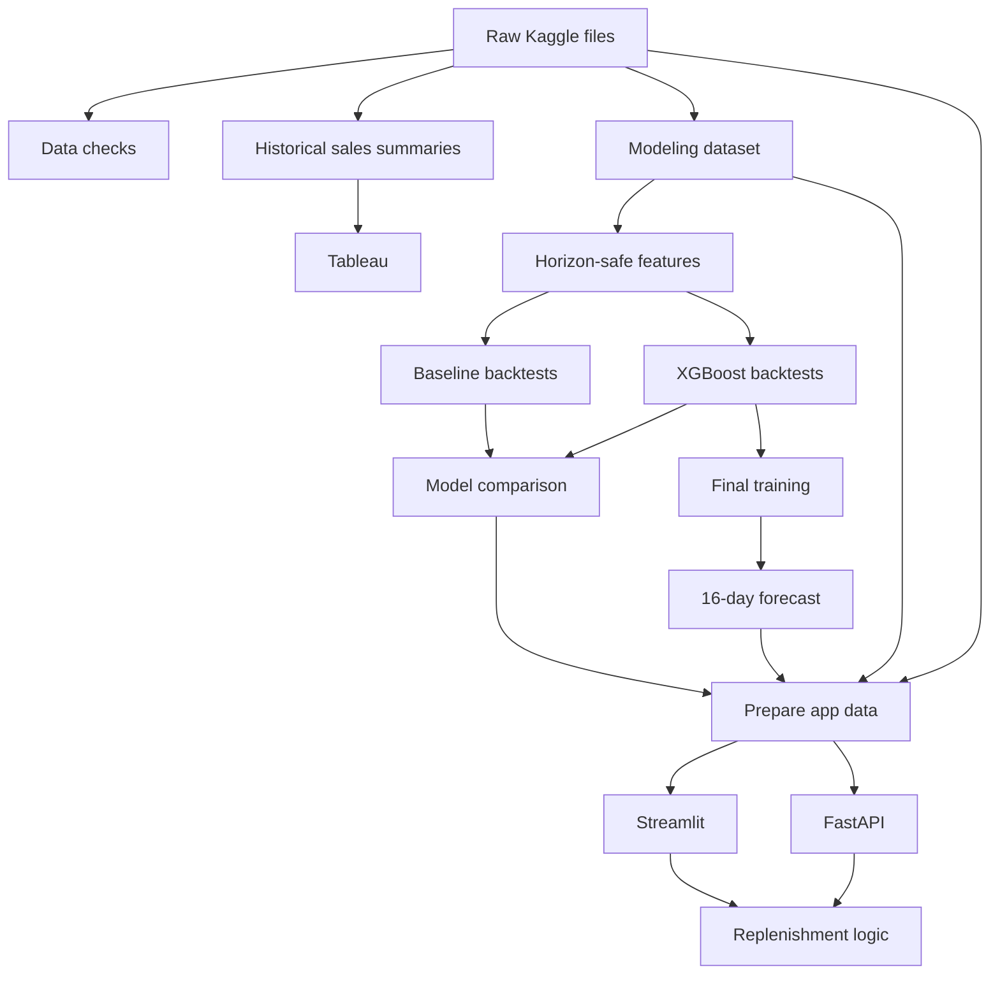

<div align="center">

# Retail Demand Forecasting

Daily store-family forecasts with a simple replenishment decision layer.

[](https://github.com/momo840505/retail-demand-forecasting/actions/workflows/tests.yml)
[](https://retail-demand-forecasting-momo.streamlit.app)
[](https://retail-demand-forecasting-api-momo.onrender.com/docs)
[](https://public.tableau.com/app/profile/wei.ting.mo/viz/RetailDemandForecastingExecutiveOverview/RetailDemandForecastingExecutiveOverview)

</div>

## Why I built it

I wanted to do a forecasting project that did not stop at "the model predicts sales."

Before studying data science I worked around sales and order planning, so I was interested in the next question too: if a forecast says demand is coming, what would someone actually do with that information?

The project therefore has two parts:

1. forecast daily demand for each store and product family;
2. use the forecast with inventory assumptions to calculate a simple replenishment suggestion.

This is a historical portfolio demo based on the Kaggle Store Sales competition. It is not connected to a retailer's live inventory system.

## Results

The model was evaluated with four consecutive 16-day chronological backtests.

| Metric | Result |
|---|---:|
| Pooled WAPE | **12.78%** |
| Pooled RMSLE | **0.3877** |
| WAPE improvement over best baseline | **24.50%** |
| RMSLE improvement over best baseline | **22.56%** |
| Backtest folds | **4** |
| Forecast horizon | **16 days** |
| Training history per fold | **730 days** |
| Inner validation window | **16 days** |

I report both WAPE and RMSLE because they answer slightly different questions. WAPE is useful for total demand error, while RMSLE puts more weight on proportional error and reduces the effect of very large sales values.

## The part I was most careful about: future-data leakage

A direct 16-day forecast should not use sales that would only become known inside those same 16 days.

The feature code therefore rejects lags shorter than the forecast horizon. The current sales-history features include:

- `sales_lag_16`
- `sales_lag_21`
- `sales_lag_28`
- `sales_lag_35`
- `sales_lag_364`
- shifted 7-day and 28-day rolling means
- shifted 28-day rolling standard deviation

Oil-price features are shifted by the same forecast horizon before they are used.

The backtest is chronological rather than a random train/test split. Each outer validation period is kept out of the inner model-selection step.

## Baselines

I compare XGBoost against simple forecasting rules instead of only reporting the model by itself:

- zero forecast;
- lag-16;
- lag-364;
- weekly seasonal naive;
- shifted 28-day mean.

That comparison is what the improvement percentages above are based on.

## Replenishment calculation

The replenishment part is a deterministic calculation, not a learned inventory-optimisation model.

```text
Inventory position = current inventory + confirmed inbound inventory
```

```text
Safety stock = average daily forecast × safety-stock days
```

```text
Reorder point = lead-time demand + safety stock
```

```text
Target inventory = protection-period demand + safety stock
```

```text
Raw order quantity = target inventory - inventory position
```

Confirmed inbound stock reduces the remaining order requirement, but it does not hide a shortage that can happen before the inbound stock arrives. The final quantity also applies minimum-order and case-pack rules.

The code rejects a request when the forecast does not cover the full lead-time plus review period.

## Live versions

### Streamlit dashboard

[Open the dashboard](https://retail-demand-forecasting-momo.streamlit.app)

The dashboard includes network demand, store-family forecasts, backtest results, model comparison, feature importance, and a replenishment scenario page.

### FastAPI service

[Open the API docs](https://retail-demand-forecasting-api-momo.onrender.com/docs)

The Render instance can be slow on the first request after inactivity because it is hosted on a free plan.

### AWS Elastic Beanstalk

I also deployed the same read-only API as a Docker application on Elastic Beanstalk in `ap-southeast-2`.

[Open the AWS API docs](http://retail-forecast-env.eba-vwkt2222.ap-southeast-2.elasticbeanstalk.com/docs)

The Docker image uses the smaller API-only requirements file instead of installing the full training and dashboard environment.

### Tableau Public

[Open the Tableau dashboard](https://public.tableau.com/app/profile/wei.ting.mo/viz/RetailDemandForecastingExecutiveOverview/RetailDemandForecastingExecutiveOverview)

The Tableau view uses historical sales summaries produced during data preparation. It is separate from the forecasting dashboard and is mainly for a business-facing overview of demand and promotion activity.

## Data flow


```mermaid
flowchart TD
    A[Raw Kaggle files] --> B[Data checks]
    A --> C[Historical sales summaries]
    A --> D[Modeling dataset]
    D --> E[Horizon-safe features]

    E --> F[Baseline backtests]
    E --> G[XGBoost backtests]
    F --> H[Model comparison]
    G --> H
    G --> I[Final training]
    I --> J[16-day forecast]

    J --> K[Prepare app data]
    H --> K
    D --> K
    A --> K

    K --> L[Streamlit]
    K --> M[FastAPI]
    L --> N[Replenishment logic]
    M --> N

    C --> O[Tableau]
```

## Main API routes

- `GET /`
- `GET /health`
- `GET /model-info`
- `GET /monitoring-info`
- `GET /stores`
- `GET /families`
- `GET /forecasts`
- `POST /replenishment`

`/monitoring-info` describes what I would monitor, but the current deployment does not have persistent production telemetry. I keep that distinction explicit in the API response.

## Promotion analysis

The historical promotion flag is observational. I do not treat promoted versus non-promoted sales as a causal A/B-test result.

`experiments/promotion_lift_analysis.py` only reports descriptive differences. A separate document explains how I would design a randomized store-level promotion test and what information would be needed for a proper power analysis.

See [docs/experiment_design_promotion_test.md](docs/experiment_design_promotion_test.md).

## Run locally

### 1. Create an environment

```powershell
python -m venv .venv
.\.venv\Scripts\Activate.ps1
python -m pip install --upgrade pip
python -m pip install -r requirements-dev.txt
python -m pip install -e .
```

### 2. Run the dashboard

```powershell
python -m streamlit run dashboard/app.py
```

### 3. Run the API

```powershell
python -m uvicorn api.main:app --reload
```

API docs:

```text
http://127.0.0.1:8000/docs
```

## Rebuild the pipeline

```powershell
python scripts/verify_raw_data.py
python scripts/profile_data.py
python scripts/build_modeling_dataset.py
python scripts/run_baseline_backtest.py
python scripts/run_xgboost_backtest.py
python scripts/train_final_model.py
python scripts/prepare_dashboard_data.py
```

## Tests

```powershell
python -m pytest -q
python -m compileall -q api dashboard src experiments scripts
python -c "from api.main import app; print(app.title)"
```

GitHub Actions runs the tests, source compilation, and FastAPI import check on pushes and pull requests to `main`.

## Project layout

```text
retail-demand-forecasting/
├── api/
├── dashboard/
├── data/
├── docs/
├── experiments/
├── reports/
├── scripts/
├── src/retail_forecasting/
├── tests/
├── Dockerfile
├── requirements.txt
├── requirements-api.txt
├── requirements-dev.txt
└── README.md
```

## Data source

The project uses the Kaggle competition [Store Sales - Time Series Forecasting](https://www.kaggle.com/competitions/store-sales-time-series-forecasting).

The original competition files are not committed to this repository.

## Current limitations

- The deployed forecast is a fixed historical 16-day window, not a live rolling forecast.
- The final Kaggle test labels are not public.
- The source data does not contain real on-hand inventory or supplier lead times.
- Safety-stock days, lead time, case-pack size, and minimum order quantity are user assumptions.
- The stockout risk bands are rules, not calibrated probabilities.
- The model does not produce prediction intervals yet.
- Monitoring is documented but there is no persistent drift/telemetry service in the current deployment.
- Retraining and ingestion are manual rather than scheduled.

## Tools used

- Python 3.11
- pandas
- XGBoost
- FastAPI
- Streamlit
- Tableau
- Plotly
- pytest
- GitHub Actions
- Docker
- AWS Elastic Beanstalk

## Notes and supporting docs

- [Backtesting strategy](docs/backtesting_strategy.md)
- [Feature availability](docs/feature_availability.md)
- [Model card](docs/model_card.md)
- [Error analysis](docs/error_analysis.md)
- [Monitoring plan](docs/monitoring_plan.md)
- [Replenishment assumptions](docs/replenishment_assumptions.md)
- [Promotion experiment design](docs/experiment_design_promotion_test.md)
